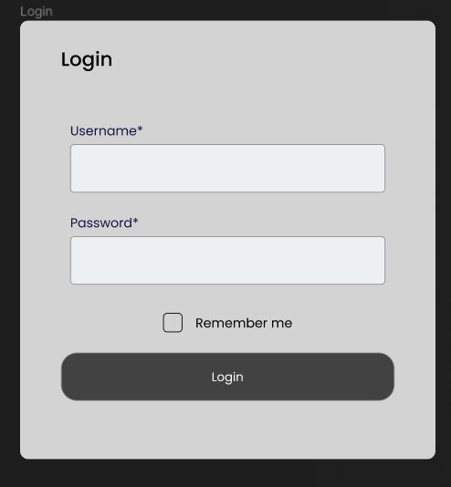
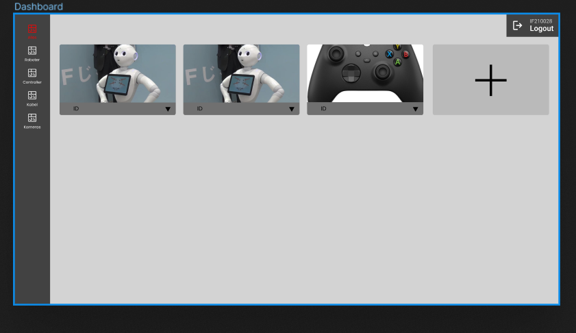
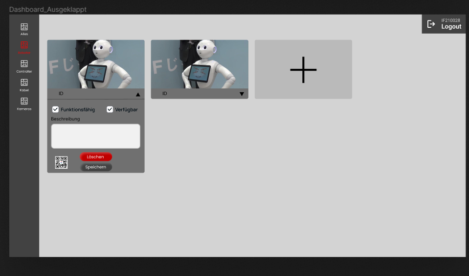
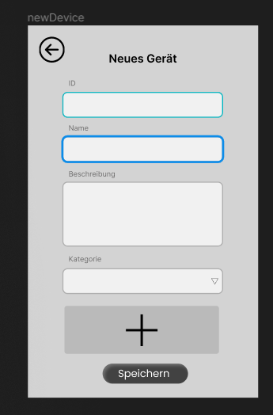

= Pflichtenheft: Entwicklung einer Inventarisierungssoftware für Hardware-Komponenten der Roboterstation

== Einleitung
Das vorliegende Pflichtenheft dient als Leitfaden für die Entwicklung einer Inventarisierungssoftware für die Hardware-Komponenten der Roboterstation im Auftrag der HTL Leonding.

== Projektziele
Erfassung einer vollständigen Liste aller Hardware-Komponenten.
Überprüfung der Verfügbarkeit, des Zustands und der Funktionsfähigkeit jeder Komponente.
Festlegung der Standorte und Verbindungen der Komponenten innerhalb der Roboterstation.
Implementierung von Funktionen zum Hinzufügen, Entfernen oder Aktualisieren von Hardware-Komponenten.
Implementierung von Generierung und Scannen von QR-Codes für jede Komponente.
Generierung von Berichten über den Zustand und die Verfügbarkeit der Hardware-Komponenten.

== Anforderungen
=== Funktionale Anforderungen
Erfassung von Hardware-Komponenten:: Die Software muss die Möglichkeit bieten, alle Hardware-Komponenten einschließlich ihrer Spezifikationen zu erfassen.
Überprüfung des Zustands:: Es soll eine Funktion geben, um den Zustand und die Funktionsfähigkeit jeder Komponente zu überprüfen.
Standortverwaltung:: Die Software sollte es ermöglichen, den Standort jeder Komponente innerhalb der Roboterstation festzulegen.
Verwaltungsfunktionen:: Es müssen Funktionen implementiert werden, um Komponenten hinzuzufügen, zu entfernen oder zu aktualisieren.
Kamera-Integration:: Die Software sollte die Integration von Kameras ermöglichen, um Bilder von Komponenten aufzunehmen und zu speichern.
QR-Code-Generierung:: Es sollte eine Funktion geben, um QR-Codes für jede Komponente zu generieren und zu drucken.
QR-Code-Scannen:: Die Software sollte die Möglichkeit bieten, QR-Codes zu scannen, um Informationen zu den Komponenten anzuzeigen.

=== Nicht-funktionale Anforderungen
Benutzerfreundlichkeit:: Die Benutzeroberfläche sollte intuitiv und einfach zu bedienen sein.
Zuverlässigkeit:: Die Software muss zuverlässig und stabil sein, um eine genaue Erfassung und Verwaltung der Komponenten sicherzustellen.
Sicherheit:: Sicherheitsmaßnahmen sollten implementiert werden, um den Zugriff auf sensible Informationen zu beschränken.

== Projektplan
Anforderungsanalyse:: Februar 2024
Softwarearchitektur-Entwurf:: März 2024
Softwareentwicklung:: April bis Mai 2024
Testphase:: Mai 2024
Projekt vollendet:: Juni 2024

== Meilensteine
Hier zu sehen: link:Meilensteine.adoc[Meilensteine]

== Benutzeroberfläche
Die Benutzeroberfläche sollte übersichtlich gestaltet sein und einfache Navigation bieten.
Erfassungsformulare für Hardware-Komponenten sollten klar strukturiert sein.
Optionen zur Überprüfung und Verwaltung von Komponenten sollten leicht zugänglich sein.

=== Mockups

== Datenmodell
Es sollte eine Datenbankstruktur definiert werden, um die erfassten Hardware-Komponenten zu speichern.
Beziehungen zwischen den Komponenten und ihren Standorten sollten klar definiert werden.

== Schnittstellen
Die Software sollte eine benutzerfreundliche Schnittstelle für die Dateneingabe und -überprüfung bieten.
Integration mit vorhandenen Systemen an der HTL Leonding (falls erforderlich).

== Testanforderungen
Es sollten umfassende Tests geschrieben und durchgeführt werden, um sicherzustellen, dass die Software ordnungsgemäß funktioniert und alle Anforderungen erfüllt werden.

== Qualitätsanforderungen
Regelmäßige Qualitätssicherungsprüfungen sollten durchgeführt werden, um die Softwarequalität sicherzustellen.
Die Software sollte den branchenüblichen Standards und Best Practices entsprechen.

== Risikomanagement
Regelmäßige Risikobewertungen sollten durchgeführt werden, um potenzielle Probleme frühzeitig zu identifizieren und zu bewältigen.
Ein Plan zur Risikominderung sollte erstellt und implementiert werden.

== Verfügbarkeit
Die Software wird rechtzeitig auf der Leocloud deployed, um den Benutzern zur Verfügung zu stehen.

== Dokumentation
Benutzerhandbuch:: Ein Handbuch zur Nutzung der Software sollte erstellt werden.
Technische Dokumentation:: Eine umfassende Dokumentation der Softwarearchitektur und -funktionalität sollte zur Verfügung gestellt werden.
Wartungsdokumentation:: Informationen zur Wartung und Fehlerbehebung sollten dokumentiert werden.
